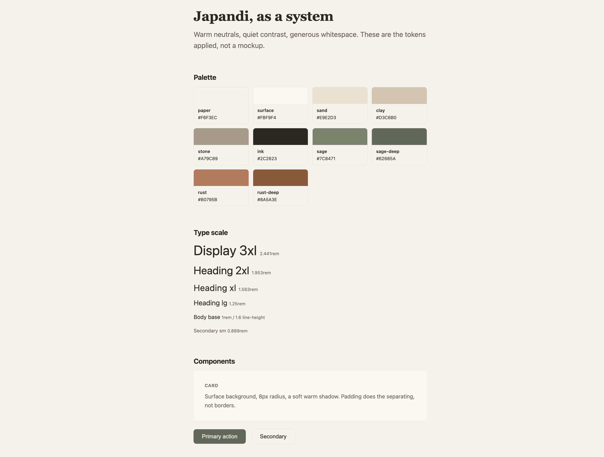

# japandi-starter

A portable japandi design system: warm neutrals, quiet contrast, generous
whitespace. One token file that generates every project's look, whatever
the stack.

## Preview




## The thesis

Theme drift happens when every project re-decides its palette. This repo makes
the decision once: one set of tokens, one Tailwind preset built on them, and a
style guide written in plain words that AI coding tools (Claude Code,
Antigravity, Cursor) can follow on any stack. New project, same look.

## What's inside

| File                        | What it is                                                                                                                                            | Use it when                                                                                |
| --------------------------- | ----------------------------------------------------------------------------------------------------------------------------------------------------- | ------------------------------------------------------------------------------------------ |
| `tokens.json`             | Design tokens in DTCG-flavored JSON: palette, type, spacing, radii, shadows, motion, z-index, focus.**The source of truth - edit values here.** | Changing any token. Then run the generator.                                                |
| `tools/build-tokens.py`   | Generator: reads`tokens.json`, writes `tokens.css`, `tailwind.preset.js`, and syncs the example's token block.                                  | After editing`tokens.json`: `python3 tools/build-tokens.py`.                           |
| `tokens.css`              | Generated CSS custom properties. Do not edit by hand.                                                                                                 | Plain CSS, or any stack that can import a stylesheet.                                      |
| `tailwind.preset.js`      | Generated Tailwind preset (v3) consuming the same tokens. Do not edit by hand.                                                                        | Tailwind projects -`presets: [require('./tailwind.preset.js')]`.                         |
| `tools/check-contrast.py` | WCAG contrast assertions: 4.5:1 for text pairs, 3:1 for non-text (borders, focus). Reads`tokens.json`.                                              | CI or before committing token changes.                                                     |
| `japandi.md`              | The rules in words: palette, whitespace, typography, motion, components, what to avoid.                                                               | Drop it into an AI coding tool's context for any frontend task, on any stack or framework. |
| `example/index.html`      | One page applying the tokens: palette, type scale, cards, buttons. Self-contained - the tokens are inlined by the generator.                          | A visual smoke test and a reference for how the pieces combine.                            |

## Usage

**Changing tokens (the maintainer workflow):** edit `tokens.json`, then run
`python3 tools/build-tokens.py` to regenerate `tokens.css`,
`tailwind.preset.js`, and the example's token block. Run
`python3 tools/check-contrast.py` to verify the contrast assertions still
pass. Commit the JSON and all generated files together.

**Any AI-generated frontend (the common path):** copy `japandi.md` into the
project and reference it in your prompt or tool config. That alone steers
colors, spacing, and component style.

**Plain CSS:** `@import './tokens.css';` then use the variables
(`background: var(--jpd-paper)`).

**Tailwind:** add the preset to `tailwind.config.js`:

```js
module.exports = {
  presets: [require('./tailwind.preset.js')],
  content: ['./src/**/*.{html,js,jsx,ts,tsx,vue,svelte}'],
};
```

Classes like `bg-paper`, `text-ink`, `text-ink-soft`, `bg-sage-deep`,
`border-border`, `border-border-strong`, `rounded-md`, `shadow-md` are then
available.

## Viewing the example

**Live preview:** [https://samiu1.github.io/japandi-starter/example/](https://samiu1.github.io/japandi-starter/example/) (GitHub
Pages, always renders the latest `main`).

On github.com, `example/index.html` shows as source code - that's GitHub's
file view, not the page. To see it rendered locally, download the file (the
download button on its page, or clone the repo) and open it in any browser.
The tokens are inlined, so the single file renders fully styled on its own -
no other repo files needed.

## Non-goals

- Not a component library. Tokens and rules only; components stay per-project.
- Not dark mode (yet). The palette is tuned for light, warm interfaces.
- Not a framework. `japandi.md` exists precisely so the look survives stacks.
