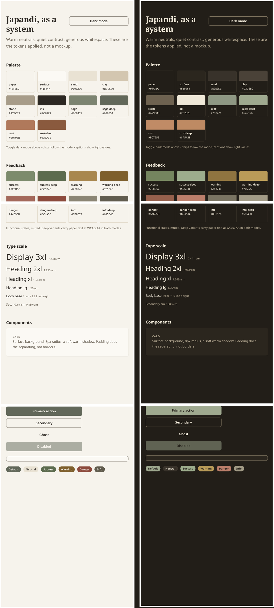

# japandi-starter

A portable japandi design system: warm neutrals, quiet contrast, generous
whitespace. One token file that generates every project's look, whatever
the stack.

## Preview



*Light and dark via the `data-theme` toggle; buttons, badges, and card from `recipes.css`.*

## The thesis

Theme drift happens when every project re-decides its palette. This repo makes
the decision once: one set of tokens, Tailwind presets built on them for v3
and v4, and a
style guide written in plain words that AI coding tools (Claude Code,
Antigravity, Cursor) can follow on any stack. New project, same look.

## What's inside

| File                        | What it is                                                                                                                                            | Use it when                                                                                |
| --------------------------- | ----------------------------------------------------------------------------------------------------------------------------------------------------- | ------------------------------------------------------------------------------------------ |
| `tokens.json`             | Design tokens in DTCG-flavored JSON: palette, type, spacing, radii, shadows, motion, z-index, focus, feedback states, and a `dark` mode.**The source of truth - edit values here.** | Changing any token. Then run the generator.                                                |
| `tools/build-tokens.py`   | Generator: reads `tokens.json`, writes `tokens.css` (with dark overrides), `tailwind.preset.js`, `tailwind.v4.css` (with dark overrides), and syncs the example's token and recipe blocks. | After editing `tokens.json`: `python3 tools/build-tokens.py`.                           |
| `tokens.css`              | Generated CSS custom properties, plus a `[data-theme="dark"]` override block. Do not edit by hand.                                                                                                 | Plain CSS, or any stack that can import a stylesheet.                                      |
| `recipes.css`             | Hand-authored component recipes (button, input, card, badge) built from the tokens. Not generated - it consumes `var(--jpd-*)`, so it follows token edits and dark mode automatically. | After `tokens.css`: `<link rel="stylesheet" href="./recipes.css">`. |
| `tailwind.preset.js`      | Generated Tailwind preset (v3) consuming the same tokens. Light values only - see dark mode below. Do not edit by hand.                                                                        | Tailwind v3 projects - `presets: [require('./tailwind.preset.js')]`.                     |
| `tailwind.v4.css`         | Generated Tailwind v4 theme (`@theme`) consuming the same tokens, plus a `[data-theme="dark"]` override block. Do not edit by hand.                                                               | Tailwind v4 projects - `@import "./tailwind.v4.css";` after `@import "tailwindcss";`.    |
| `tools/check-contrast.py` | WCAG contrast assertions in both modes: 4.5:1 for text pairs, 3:1 for non-text (borders, focus). Reads `tokens.json`.                                              | CI or before committing token changes.                                                     |
| `japandi.md`              | The rules in words: palette, whitespace, typography, motion, components, what to avoid.                                                               | Drop it into an AI coding tool's context for any frontend task, on any stack or framework. |
| `example/index.html`      | One page applying the tokens: palette, type scale, cards, buttons. Self-contained - the tokens are inlined by the generator.                          | A visual smoke test and a reference for how the pieces combine.                            |

## Usage

**Changing tokens (the maintainer workflow):** edit `tokens.json`, then run
`python3 tools/build-tokens.py` to regenerate `tokens.css`,
`tailwind.preset.js`, `tailwind.v4.css`, and the example's token block. Run
`python3 tools/check-contrast.py` to verify the contrast assertions still
pass. Commit the JSON and all generated files together.

**Any AI-generated frontend (the common path):** copy `japandi.md` into the
project and reference it in your prompt or tool config. That alone steers
colors, spacing, and component style.

**Plain CSS:** `@import './tokens.css';` then use the variables
(`background: var(--jpd-paper)`).

**Component recipes:** after `tokens.css`, add `recipes.css` for button,
input, card, and badge styles built from the tokens:

```html
<link rel="stylesheet" href="./tokens.css">
<link rel="stylesheet" href="./recipes.css">
```

Then use `jpd-btn`, `jpd-btn--secondary`, `jpd-btn--ghost`, `jpd-input`,
`jpd-card`, `jpd-badge` (plus `jpd-badge--success/--warning/--danger/--info`
and `jpd-badge--neutral`). They are starting points, not a library - copy
them into the project and adapt.

**Dark mode:** set `data-theme="dark"` on the `<html>` element. `tokens.css`
and `tailwind.v4.css` each carry a `[data-theme="dark"]` block that flips
every color and shadow variable, so plain-CSS variables, `recipes.css`, and
Tailwind v4 utilities all follow. To follow the OS preference:

```js
if (matchMedia('(prefers-color-scheme: dark)').matches) {
  document.documentElement.setAttribute('data-theme', 'dark');
}
```

Dark is warm charcoal, never pure black, and every documented text pairing
still passes WCAG AA - verified by `tools/check-contrast.py` in both modes.
The Tailwind v3 preset is light-only: its colors are literals (so opacity
modifiers like `bg-sage/50` keep working), which can't flip per theme.

**Tailwind v3:** add the preset to `tailwind.config.js`:

```js
module.exports = {
  presets: [require('./tailwind.preset.js')],
  content: ['./src/**/*.{html,js,jsx,ts,tsx,vue,svelte}'],
};
```

**Tailwind v4:** import the theme in your CSS, after Tailwind itself:

```css
@import "tailwindcss";
@import "./tailwind.v4.css";
```

Classes like `bg-paper`, `text-ink`, `text-ink-soft`, `bg-sage-deep`,
`border-border`, `border-border-strong`, `rounded-md`, `shadow-md` are then
available. Motion durations, z-index, and focus width/offset have no v4
theme namespace - v4 accepts them as bare values (`duration-250`, `z-100`,
`outline-2`, `outline-offset-2`), and the focus color is `outline-focus`.

## Viewing the example

**Live preview:** [https://samiu1.github.io/japandi-starter/example/](https://samiu1.github.io/japandi-starter/example/) (GitHub
Pages, always renders the latest `main`).

On github.com, `example/index.html` shows as source code - that's GitHub's
file view, not the page. To see it rendered locally, download the file (the
download button on its page, or clone the repo) and open it in any browser.
The tokens are inlined, so the single file renders fully styled on its own -
no other repo files needed.

## Non-goals

- Not a component library. Tokens, modes, and thin recipes only; anything
  fancier stays per-project.
- Not a framework. `japandi.md` exists precisely so the look survives stacks.
