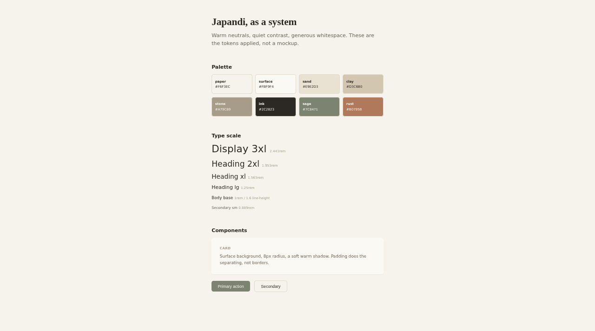

# japandi-starter

A portable japandi design system: warm neutrals, quiet contrast, generous
whitespace. Three small files that give every project the same look, whatever
the stack.

## Preview



## The thesis

Theme drift happens when every project re-decides its palette. This repo makes
the decision once: one set of tokens, one Tailwind preset built on them, and a
style guide written in plain words that AI coding tools (Claude Code,
Antigravity, Cursor) can follow on any stack. New project, same look.

## What's inside

| File | What it is | Use it when |
| --- | --- | --- |
| `tokens.css` | Design tokens as CSS custom properties: palette, type scale, spacing, radii, shadows. | Plain CSS, or any stack that can import a stylesheet. The source of truth. |
| `tailwind.preset.js` | Tailwind preset consuming the same palette and scale. | Tailwind projects - `presets: [require('./tailwind.preset.js')]`. |
| `japandi.md` | The rules in words: palette, whitespace, typography, texture, components, what to avoid. | Drop it into an AI coding tool's context for any frontend task, on any stack or framework. |
| `example/index.html` | One page applying the tokens: palette, type scale, cards, buttons. Self-contained - the tokens are inlined. | A visual smoke test and a reference for how the pieces combine. |

## Usage

**Any AI-generated frontend (the common path):** copy `japandi.md` into the
project and reference it in your prompt or tool config. That alone steers
colors, spacing, and component style.

**Plain CSS:** `@import './tokens.css';` then use the variables
(`background: var(--jpd-paper)`).

**Tailwind:** add the preset to `tailwind.config.js`:

```js
module.exports = {
  presets: [require('./tailwind.preset.js')],
  content: ['./src/**/*.{html,js,jsx,ts,tsx,vue,svelte}'],
};
```

Classes like `bg-paper`, `text-ink`, `text-ink-soft`, `bg-sage`, `border-sand`,
`rounded-md`, `shadow-md` are then available.

## Viewing the example

**Live preview:** <https://samiu1.github.io/japandi-starter/example/> (GitHub
Pages, always renders the latest `main`).

On github.com, `example/index.html` shows as source code - that's GitHub's
file view, not the page. To see it rendered locally, download the file (the
download button on its page, or clone the repo) and open it in any browser.
The tokens are inlined, so the single file renders fully styled on its own -
no other repo files needed.

## Non-goals

- Not a component library. Tokens and rules only; components stay per-project.
- Not dark mode (yet). The palette is tuned for light, warm interfaces.
- Not a framework. `japandi.md` exists precisely so the look survives stacks.
